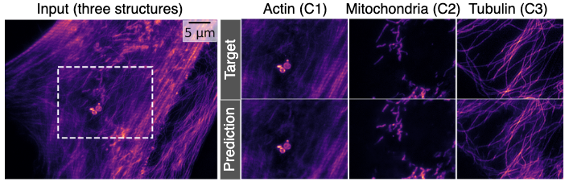

# Image Restoration: denoising and splitting


Welcome to the Image Restoration exercises. In this part of the course, we will explore
how to use deep learning to denoise images, with examples of widely used algorithm for
both supervised and unsupervised denoising. We will also explore the difference
between unstructured and structured noise, and between UNet (which you are familiar with
by now) and VAE architectures (see `COSDD` exercises)!
We'll also tackle the task of image decomposition (or splitting, unmixing) where a single image exhibiting superimposed labeled structures is decomposed in multiple channels, each one corresponding to a different labeled structure using the `MicroSplit` algorithm.


## Setup

Please run the setup script to create the environment for these exercises and download data.

``` bash
source setup.sh
```

## Exercises
The first exercise, [1. Context-aware restoration (CARE)](01_CARE/exercise.ipynb) will introduce you to deep learning-based image restoration by training a UNet for denoising.

Then, in the [2. Noise2Void (N2V)](02_Noise2Void/exercise.ipynb) exercise you will train a denoiser using only noisy data, i.e., in a self-supervised way.
Indeed, unlike CARE, it doesn't need any examples of clean images.
It's also relatively quick to train.
For these reasons, it has become a go-to method for denoising in microscopy imaging.
But there's a catch.
It relies on the assumption that the noise is unstructured.
Unstructured noise is uncorrelated over pixels, so it has no streaky or line artifacts.
An example is shown below.


The next exercise is about [3. MicroSplit](03_MicroSplit/exercise.ipynb).
MicroSplit is a deep learning algorithm that jointly performs computational unmixing and denoising.
Specifically, it uses a VAE architecture to separate multiple superimposed cellular structures within a single fluorescent image channel, turning a single channel into as many as 4.
Imaging multiple cellular structures in a single fluorescent channel effectively increases the available photon budget, which can be reallocated to achieve faster imaging, higher signal-to-noise ratios, or the imaging of additional structures. 
An example of splitting is shown below.



## Bonus exercise
If you've finished these exercises, have a look at [4. COSDD](04_bonus_COSDD/exercise.ipynb). 
In this exercise will introduce another denoiser that is trained using unpaired noisy images, but can handle a specific form of structure.
That structure is row correlation.
Row-correlated noise is common in scanning-based imaging techniques like point-scanning confocal microscopy.
It can also be found when using sCMOS sensors.
The practical trade-off with N2V is that COSDD takes much longer to train.
An example of row-correlated noise is shown below.


